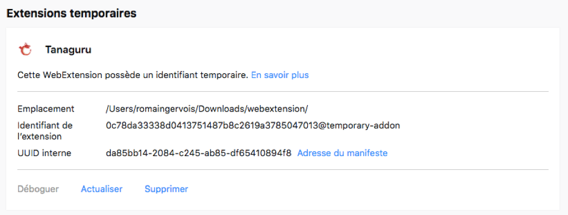

# Tanaguru Webextension


Outil d'évaluation de l'accessibilité Web (et plus).

## A propos

* Auteur : Romain Gervois ;
* Projet : Tanaguru Webextension (Firefox, pour le moment) ;
* Date de rédaction du document : 26/02/2018.

## Installer la webextension

Pour installer la webextension, **dans la barre d’adresse** de Firefox 57 ou supérieur, saisissez **« about:debugging »**. La page « Modules » s’affiche :


Sur cette page, activez le lien **« Ce Firefox »**.


Sur cette page, activez le bouton **« Charger un module temporaire »**. Une boîte de dialogue de fichier s’affiche alors. Depuis cette boîte, sélectionnez sur votre disque local, le fichier **« manifest.json »**. Cette sélection termine l’installation de la webextension.



Note : la webextension est installée temporairement. C’est-à-dire qu’elle sera désinstallée à la fermeture de Firefox.

## Utiliser la webextension

Une fois, l’installation réalisée, un bouton **« Tanaguru »** apparait dans la barre d’outils de Firefox. Ce bouton permet à l’utilisateur via l’affichage d’une fenêtre popup de connaître la version de la webextension, la procédure pour démarrer les tests et d’aller consulter le site de Tanaguru pour plus d’informations.


Pour démarrer les tests, **rendez-vous sur la page à analyser** puis, si l’outil de développement n’est pas déjà affiché, allez dans **« Outils > Développement Web > Outils de développement »** puis activez l’onglet **« Tanaguru »**.


Activez le bouton **« Analyser cette page »**. Selon la « complexité » du DOM de la page à analyser, un message peut vous demander si vous souhaitez « Arrêter le script » ou **« Patienter »** (choisissez cette option pour continuer). Les résultats s’affichent enfin en lieu et place du bouton « Analyser cette page ».


Chaque résultat est accompagné de trois boutons :


* **« Mettre en évidence sur la page »** permet d’appliquer une présentation particulière afin de faire ressortir visuellement l’élément sur la page ;
* **« Révéler dans l'inspecteur »** permet d'identifier et de sélectionner le nœud HTML correspondant dans l’inspecteur de la page ;
* **« À propos de cet élément »** permet de consulter et récupérer les différentes informations propres à l'élément (comme par exemple les représentations XPath et CSS).

## Écrire un test

*Mise à jour de la syntaxe d'écriture d'un test (06/11/2018).*

L’écriture d’un test s’effectue depuis le fichier Javascript **« /ressources/scripts/tests.js »**.

### Fonction `createTanaguruTest`

La fonction `createTanaguruTest` vous permet de créer un nouveau test.

Cette fonction prend en paramètre un objet JSON permettant de définir les différentes caractéristiques du test.

```
createTanaguruTest({});
```
#### Caractéristiques du test

| Propriété | Description | Valeur attendue |
| :-- | :-- | :-- |
| lang | Langue de rédaction du test. | String. |
| name | Intitulé du test. | String. |
| query | Sélecteurs CSS permettant de définir l'échantillon. | String. |
| filter | Fonction de filtrage permettant de restreindre l'échantillon. | Function. |
| expectedNbElements | Nombre d'éléments attendus dans l'échantillon (précis ou compris entre deux bornes) permettant de valider ou d'invalider le test. | Integer ou Object (avec propriétés min (Integer), max (Integer) ou les deux). |
| explanations | Explications associées aux statuts du test. | Object (avec propriétés passed (String) et failed (String)). |
| mark | Application de mises en surbrillance d'attributs dans les passages de code dans l'interface des résultats. | Object (avec propriété attrs (Array)). |
| tags | Étiquettes associées aux champs. Note : il ne s'agit pas des intitulés d'étiquettes mais d'identifiants d'étiquettes (i18n). | Array de String. |
| ressources | Ressources associées aux tests. | Object (chaque propriété identifiant une ressource et valorisée par un Array de String). |

### Exemples de test

#### Liens s'ouvrant dans des nouvelles fenêtres

Par exemple, si vous souhaitez lister tous les liens possédant un attribut `target=“_blank“` :

````
createTanaguruTest({
	lang: 'fr',
	name: "Liens s'ouvrant dans des nouvelles fenêtres.",
	query: 'a[href][target="_blank"]:not([role])',
	mark: { attrs: ['target'] },
	tags: ['a11y', 'links'],
	ressources: { 'rgaa': ['13.2.1'] }
});
````

Note : l'absence des propriétés ``expectedNbElements`` et ``explanations`` fait que le test sera indiqué comme à expertiser.

#### Liens avec attributs ``title`` vides

Par exemple, si vous souhaitez vérifier que les attributs ``title`` sur les liens sont bien renseignés :

````
createTanaguruTest({
	lang: 'fr',
	name: 'Liens avec attributs title vides.',
	query: 'a[href][title]:not([role])',
	filter: function (item) {
		return item.getAttribute('title').trim().length == 0;
	},
	expectedNbElements: 0,
	explanations: {
		'passed': "Cette page ne contient pas d'éléments a avec attributs title vides.",
		'failed': "Des éléments a avec attributs title vides sont présents dans la page."
	},
	mark: { attrs: ['title'] },
	tags: ['a11y', 'links'],
	ressources: { 'rgaa': ['6.2.1', '6.2.2', '6.2.3'] }
});
`````

---


