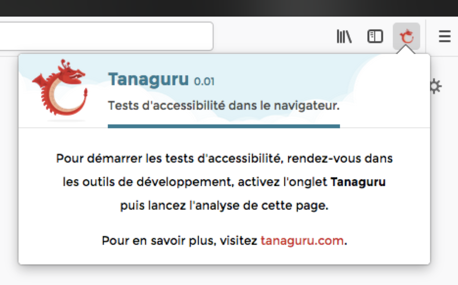

# Tanaguru Webextension


Outil d'évaluation de l'accessibilité Web (et plus).

## A propos

* Auteur : Romain Gervois ;
* Projet : Tanaguru Webextension (Firefox, pour le moment) ;
* Date de rédaction du document : 26/02/2018.

## Installer la webextension

Pour installer la webextension, **dans la barre d’adresse** de Firefox 57 ou supérieur, saisissez **« about:debugging »**. La page « Modules » s’affiche :


Sur cette page, activez le bouton **« Charger un module temporaire »**. Une boîte de dialogue de fichier s’affiche alors. Depuis cette boîte, sélectionnez sur votre disque local, le fichier **« manifest.json »**. Cette sélection termine l’installation de la webextension.


Note : la webextension est installée temporairement. C’est-à-dire qu’elle sera désinstallée à la fermeture de Firefox.

## Utiliser la webextension

Une fois, l’installation réalisée, un bouton **« Tanaguru »** apparait dans la barre d’outils de Firefox. Ce bouton permet à l’utilisateur via l’affichage d’une fenêtre popup de connaître la version de la webextension, la procédure pour démarrer les tests et d’aller consulter le site de Tanaguru pour plus d’informations.



Pour démarrer les tests, **rendez-vous sur la page à analyser** puis, si l’outil de développement n’est pas déjà affiché, allez dans **« Outils > Développement Web > Outils de développement »** puis activez l’onglet **« Tanaguru »**.


Activez le bouton **« Analyser cette page »**. Selon la « complexité » du DOM de la page à analyser, un message peut vous demander si vous souhaitez « Arrêter le script » ou **« Patienter »** (choisissez cette option pour continuer). Les résultats s’affichent enfin en lieu et place du bouton « Analyser cette page ».


Chaque résultat est accompagné de trois boutons :


* **« Mettre en évidence sur la page »** permet d’appliquer une présentation particulière afin de faire ressortir visuellement l’élément sur la page ;
* **« Révéler dans l'inspecteur »** permet de retrouver et sélectionner le nœud correspondant dans l’inspecteur de la page ;
* **« À propos de cet élément »** permet de consulter et récupérer les différentes informations propres à l'élément (comme par exemple les représentations XPath et CSS).

## Écrire un test

*Note au 30/03/2018 : les explications données dans cette partie sont susceptibles de ne plus être applicables dans la prochaine version de la webextension. Une mise à jour sera publiée lors de la publication de cette nouvelle version.*

L’écriture d’un test s’effectue depuis le fichier Javascript **« /common/scripts/analyze.js »**.

Intégrer entre la ligne de création de la variable json (`var json = {};`) et la ligne de renvoi de valeur (`json;`) le test que vous souhaitez réaliser et ajouter aux résultats de la webextension.

### Exemple : liens s'ouvrant dans des nouvelles fenêtres

Par exemple, si vous souhaitez lister tous les liens possédant un attribut `target=“_blank“`, utilisez d’abord la méthode DOM permettant de rechercher ces éléments :

```
var linksWithTargetBlank = document.querySelectorAll(‘a[href][target=“_blank“]’);
```

Créez ensuite un tableau vide puis remplissez-le en parcourant chacun des éléments trouvés :

```
var linksWithTargetBlankSet = [];
for (var i = 0; i < linksWithTargetBlank.length; i++) {
	linksWithTargetBlankSet.push(manageOutput(linksWithTargetBlank[i]));
}
```

Note : la fonction `manageOutput` génère un objet JSON avec les différentes informations nécessaires pour exploitation par l’interface de la webextension.

Enfin, appelez la fonction `addResultSet` avec :

* En premier paramètre, le nom du panneau où les résultats seront affichés ;
* En second paramètre, un objet JSON avec :
	* La propriété `name` correspondant au nom du test réalisé ;
	* La propriété `type` correspondant à la nature des résultats (valeur « failure » s’il s’agit d’éléments en erreur ou valeur « humanneeded » s’il s’agit d’éléments à expertiser) ;
	* La propriété `data` correspondant à l’objet contenant les résultats ;
	* Optionnellement, la propriété `description` correspondant à un texte accompagnant les résultats (consignes, explications, etc.) ;
	* Optionnellement, la propriété `mark` correspondant à une expression régulière qui sera utilisée pour mettre en valeur certains passages de code dans l’aperçu depuis l’interface de la webextension.

pour que les résultats soient chargés et exploités par l’interface de la webextension :

```
addResultSet(‘Liens’, { 
	name: 'Liens avec attribut target=”_blank”', 
	type: 'humanneeded', 
	data: linksWithTargetBlankSet, 
	mark: '(target=&quot;(?:(?!&quot;).)*&quot;)' 
});
```

Note : si le premier paramètre (« Liens ») a déjà été utilisé, l’objet JSON spécifié viendra compléter le (ou les) objet(s) JSON précédemment spécifié(s) et l’ensemble de ces objets seront chargés et affichés dans le même panneau.

---

