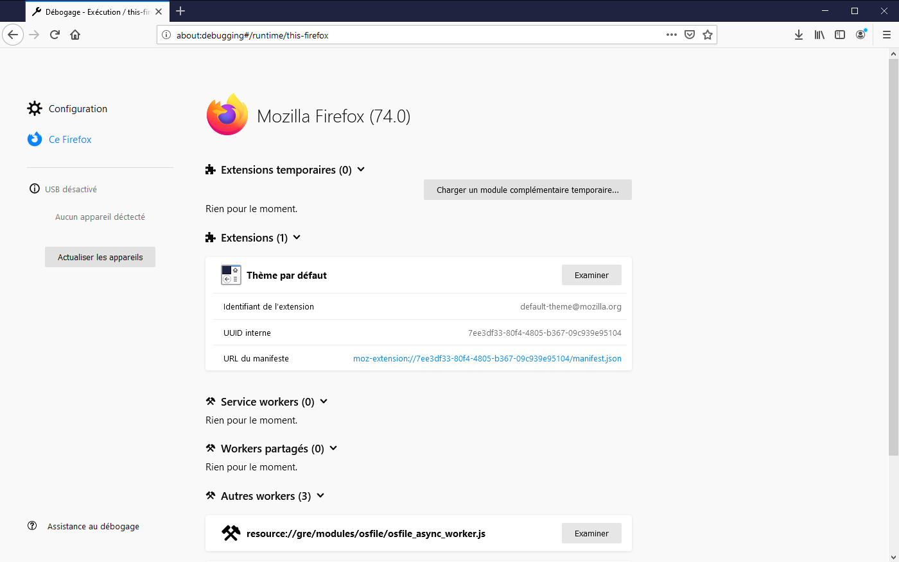
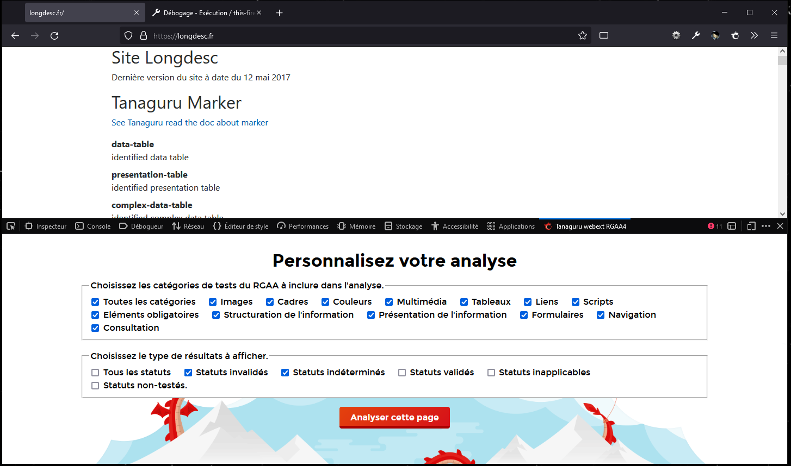

# Tanaguru Webextension


[Click here to read the english version](/README_en.md)

Outil d'évaluation de l'accessibilité Web (et plus).

## A propos

* Auteur : Tanaguru
* Projet : Tanaguru Webextension (Firefox et Chrome)
* Date de rédaction du document : 26/02/2018
* Date de mise à jour du document : 03/12/2021

## Sommaire
- [Installer la webextension sur votre navigateur](#installer-la-webextension-sur-votre-navigateur)
- [Installer la webextension en local](#installer-la-webextension-en-local)
- [Utiliser la webextension](#utiliser-la-webextension)
- [Ecrire un test](#écrire-un-test)
- [Mettre à jour le numéro de version](#mettre-à-jour-le-numéro-de-version)

## Installer la webextension sur votre navigateur
La webextension est disponible sur les stores de Mozilla Firefox et Google Chrome.
- [webextension Tanaguru pour Firefox](https://addons.mozilla.org/fr/firefox/addon/tanaguru-webext)
- [webextension Tanaguru pour Chrome](https://chrome.google.com/webstore/detail/tanaguru-webext/hhopdkekcmkdfpdjbpajmmfbheglcaac)

## Installer la webextension en local
1. **Télécharger ou cloner le projet** ici : [répertoire du projet](https://github.com/Tanaguru/webextension)
2. Pour installer la webextension, vous aurez besoin de **télécharger et installer Node.js**. [Page de téléchargement de Node.js](https://nodejs.org/fr/download/)
3. **Installer les dépendances du projet et effectuer le "build"** : 
   - accéder au dossier racine du projet avec un terminal (powershell, git bash...) ou ouvrez le projet avec votre éditeur de code et lancez le terminal.
   - envoyez ces 2 commandes dans le terminal :
  ```bash
  npm install
  npm run-script build
  ```
4. **Installation sur Firefox**

Pour installer la webextension, **dans la barre d’adresse** de Firefox 57 ou supérieur, saisissez **« about:debugging »**. La page « Modules » s’affiche :


Sur cette page, activez le lien **« Ce Firefox »**.



Sur cette page, activez le bouton **« Charger un module temporaire »**. Une boîte de dialogue de fichier s’affiche alors. Depuis cette boîte, sélectionnez sur votre disque local, le fichier **« manifest.json »** dans le dossier "/webextension/dist/tanaguru-rgaa4-x.x.x" pour la version RGAA ou "/webextension/dist/tanaguru-wcag-x.x.x" pour la version WCAG. Cette sélection termine l’installation de la webextension.


Note : la webextension est installée temporairement. C’est-à-dire qu’elle sera désinstallée à la fermeture de Firefox.

5. **Installation sur Chrome**

Dans la barre d'adresse du navigateur Chrome, tapez ceci : **chrome://extensions**

La page des extensions s'affiche.

Sur cette page activez le **mode développeur** puis cliquez sur le bouton **"charger l'extension non empaquetée"**.

Une boite de dialogue de fichier s'affiche. 


Depuis cette boîte, sélectionnez sur votre disque local, le dossier "/webextension/dist/tanaguru-rgaa4-x.x.x" pour la version RGAA ou "/webextension/dist/tanaguru-wcag-x.x.x" pour la version WCAG. Cette sélection termine l’installation de la webextension.

## Utiliser la webextension

Une fois, l’installation réalisée, un bouton **« Tanaguru »** apparait dans la barre d’outils du navigateur. Ce bouton permet à l’utilisateur via l’affichage d’une fenêtre popup de connaître la version de la webextension, la procédure pour démarrer les tests et l'accès au lien permettant de consulter le site de Tanaguru pour plus d’informations.


Pour démarrer les tests, **rendez-vous sur la page à analyser**.

Ouvrez l'outil de développement. (raccourci clavier : **ctrl+maj+i**)

Accès à l'outil de développement sur Firefox : **« Menu > Outils supplémentaires > Outils de développement web»** 

Accès à l'outil de développement sur Chrome : **« Menu > Plus d'outils > Outils de développement»** 

Puis dans l'outil de développement activez l’onglet **« Tanaguru Webext RGAA/WCAG»**.


Nous sommes ici sur la page d'accueil de la webextension, d'ici vous pouvez personnaliser votre analyse puis démarrer l'analyse de la page dans l'onglet actif.
Activez le bouton **« Analyser cette page »**, le tableau de bord s'affiche. Selon la « complexité » du DOM de la page à analyser, les premiers résultats peuvent mettre un peu de temps avant de s'afficher.

Depuis le tableau de bord vous pouvez relancer la même analyse (avec les mêmes filtres activés) ou revenir sur la page d'accueil pour configurer une nouvelle analyse.


Chaque résultat est accompagné de trois boutons :


* **« Mettre en évidence sur la page »** permet d’appliquer une présentation particulière afin de faire ressortir visuellement l’élément sur la page ;
* **« Révéler dans l'inspecteur »** permet d'identifier et de sélectionner le nœud HTML correspondant dans l’inspecteur de la page ;
* **« À propos de cet élément »** permet de consulter et récupérer les différentes informations propres à l'élément (comme par exemple les représentations XPath et CSS).

## Écrire un test

*Mise à jour de la syntaxe d'écriture d'un test (03/12/2021).*

L’écriture d’un test RGAA s’effectue depuis le fichier Javascript **« /src/references/rgaa4/{thématique}.js »**.

L’écriture d’un test WCAG s’effectue depuis le fichier Javascript **« /src/references/wcag/wcag.js »**.

### Fonction `createTanaguruTest`

La fonction `createTanaguruTest` vous permet de créer un nouveau test.

Cette fonction prend en paramètre un objet JSON permettant de définir les différentes caractéristiques du test.

Un test ne peut avoir que l'une des propriétés ("status" OU "testStatus" OU "expectedNbElements).

```
createTanaguruTest({});
```
#### Caractéristiques du test

| Propriété | Description | Valeur attendue |
| :-- | :-- | :-- |
| lang | Langue de rédaction du test. | String. |
| name | Intitulé du test. | String. |
| status | Permet de définir le test comme "non testé" | String (untested) |
| query | Sélecteurs CSS permettant de définir l'échantillon. | String. |
| contrast | Récupérer une liste de noeuds texte, traitée dans le script contrast.js | String (nom de l'index du tableau). |
| code | Récupérer la liste des noeuds avec un ID dupliqué | String ("id"). |
| node | Récupérer un noeud non accessible via la propriété query | Node (ex: document.doctype). |
| testStatus | Définir le statut des éléments de l'échantillon | String (passed/failed/cantTell/inapplicable) |
| filter | Fonction de filtrage permettant de restreindre l'échantillon. | Function. |
| analyzeElements | Fonction permettant de traiter l'ensemble de l'échantillon (exécuté après la fonction de filtre) | Function. |
| expectedNbElements | Nombre d'éléments attendus dans l'échantillon (précis ou compris entre deux bornes) permettant de valider ou d'invalider le test. | Integer ou Object (avec propriétés min (Integer), max (Integer) ou les deux). |
| explanations | Explications associées aux statuts du test. | Object (avec propriétés passed (String) et failed (String)). |
| mark | Application de mises en surbrillance d'attributs dans les passages de code dans l'interface des résultats. | Object (avec propriété attrs (Array)). |
| tags | Étiquettes associées aux champs. Note : il ne s'agit pas des intitulés d'étiquettes mais d'identifiants d'étiquettes (i18n). | Array de String. |
| ressources | Ressources associées aux tests. | Object (chaque propriété identifiant une ressource et valorisée par un Array de String). |

### Exemples de test

#### Liens s'ouvrant dans des nouvelles fenêtres

Par exemple, si vous souhaitez lister tous les liens possédant un attribut `target=“_blank“` :

````
createTanaguruTest({
	lang: 'fr',
	name: "Liens s'ouvrant dans des nouvelles fenêtres.",
	query: 'a[href][target="_blank"]:not([role])',
	testStatus: "cantTell",
	mark: { attrs: ['target'] },
	tags: ['a11y', 'links'],
	ressources: { 'rgaa': ['13.2.1'] }
});
````

Note : La propriété ``testStatus: "cantTell"`` fait que le test sera indiqué comme à expertiser.

#### Liens avec attributs ``title`` vides

Par exemple, si vous souhaitez vérifier que les attributs ``title`` sur les liens sont bien renseignés :

````
createTanaguruTest({
	lang: 'fr',
	name: 'Liens avec attributs title vides.',
	query: 'a[href][title]:not([role])',
	filter: function (item) {
		return item.getAttribute('title').trim().length == 0;
	},
	expectedNbElements: 0,
	explanations: {
		'passed': "Cette page ne contient pas d'éléments a avec attributs title vides.",
		'failed': "Des éléments a avec attributs title vides sont présents dans la page."
	},
	mark: { attrs: ['title'] },
	tags: ['a11y', 'links'],
	ressources: { 'rgaa': ['6.2.1', '6.2.2', '6.2.3'] }
});
````

---

## Mettre à jour le numéro de version
### VERSION.txt
Le numéro se décompose comme ceci: x.y.z
Avec x = nouvelle fonctionnalité, y = mise à jour, z = correction

### CHANGELOG.md
A chaque nouvelle version on liste brièvement ce que change la nouvelle version.
