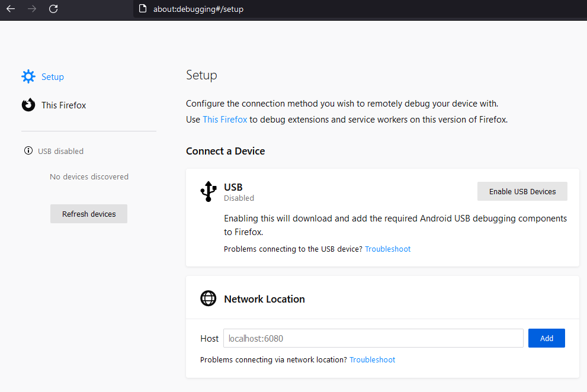
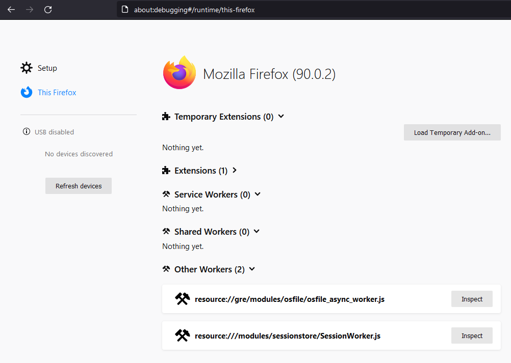
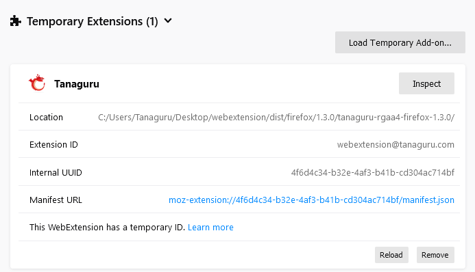
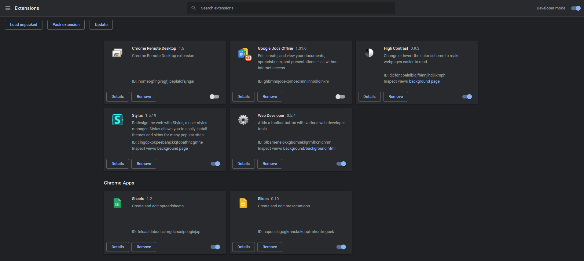
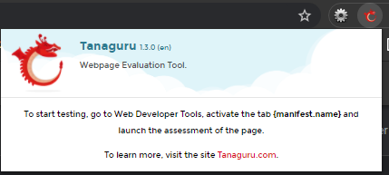
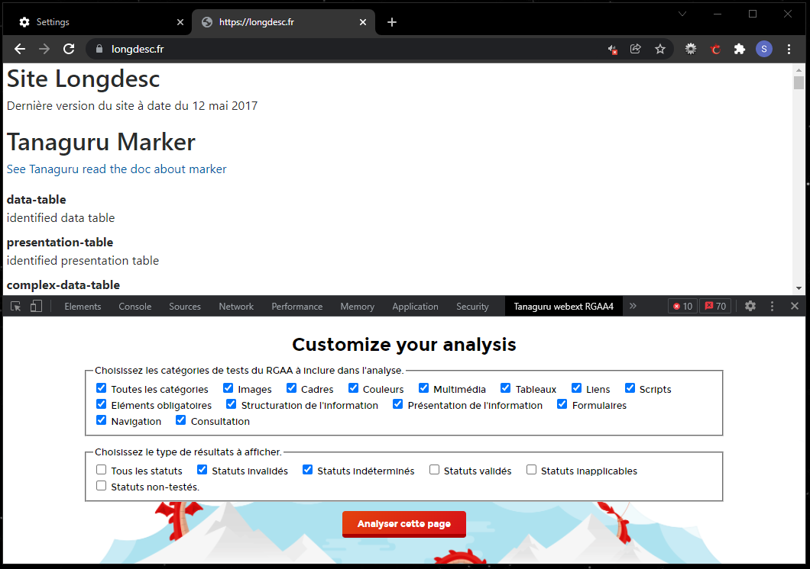
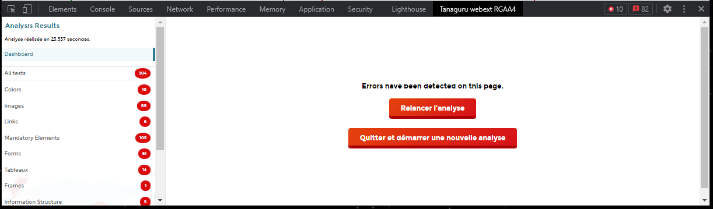

# Tanaguru Webextension


[Cliquer ici pour lire la version en français](/README.md)

Web accessibility evaluation tool (and more).

## About

* Author : Tanaguru
* Project : Tanaguru Webextension (Firefox and Chrome)
* Date the document was written : 2018/02/26
* Document update date : 2024/10/21

## Summary
- [Tanaguru Webextension](#tanaguru-webextension)
  - [About](#about)
  - [Summary](#summary)
  - [Install the webextension on your browser](#install-the-webextension-on-your-browser)
  - [Install the webextension locally](#install-the-webextension-locally)
  - [Use the webextension](#use-the-webextension)
  - [Write a test](#write-a-test)
    - [Function `createTanaguruTest`](#function-createtanagurutest)
      - [Test characteristics](#test-characteristics)
    - [Test examples](#test-examples)
      - [Links opening in new windows](#links-opening-in-new-windows)
      - [Grouping of fields with/without caption.](#grouping-of-fields-withwithout-caption)
      - [Links with empty `title` attribute](#links-with-empty-title-attribute)
  - [Update the version number](#update-the-version-number)
    - [VERSION.txt](#versiontxt)
    - [CHANGELOG.md](#changelogmd)

## Install the webextension on your browser
The webextension is available on the Mozilla Firefox and Google Chrome stores.
- [Tanaguru webextension for Firefox](https://addons.mozilla.org/en-US/firefox/addon/tanaguru-webext)
- [Tanaguru webextension for Chrome](https://chrome.google.com/webstore/detail/tanaguru-webext/hhopdkekcmkdfpdjbpajmmfbheglcaac)

## Install the webextension locally

**<u>Disclaimer</u> (October 21th 2024) :**

The Tanaguru Webextension have been upgraded to Manifest V3. However few features aren't fully supported yet on Mozilla Firefox (**code inspection**).

The current source code is fully compatible locally for Chrome <u>but it's not yet the case for Mozilla Firefox</u>.

1. **Download or clone the project** here : [project directory](https://github.com/Tanaguru/webextension)
2. To install the webextension, you will need to **download and install Node.js** in version 16. [Download page of Node.js](https://nodejs.org/en/download/)
3. **Install the project dependencies and do the "build"** : 
   - access the root folder of the project with a terminal (powershell, git bash...) or open the project with your code editor and lauch the terminal.
   - send this 2 commands in the terminal :
  ```bash
  npm install
  npm run-script build
  ```

4. **Installation on Firefox**

To install the webextension, **in the address bar** of Firefox 57 or highter, type **« about:debugging »**. The « Extensions » page displays :



On this page, activate the link **« This Firefox »**.



On this page, activate the button **« Load Temporary Add-on... »**. A file dialog box will appear. From this box, select on your local disk, the file **« manifest.json »** in the folder "/webextension/dist/firefox/tanaguru-rgaa4-firefox-1.3.0" for RGAA version or "/webextension/dist/firefox/tanaguru-wcag-firefox-1.3.0" for WCAG version. This selection ends the installation of the webextension.



Note : the webextension is temporarily installed. It will be uninstalled when you close Firefox.

5. **Installation on Chrome**

In the address bar of the Chrome browser, type this : **chrome://extensions**

The extensions page is displayed.

On this page activate **Developer mode** and click on the button **"Load unpacked"**.

A file dialog box is displayed.


From this box, select on your local disk, the folder "/webextension/dist/chrome/tanaguru-rgaa4-chrome-1.3.0" for RGAA version or "/webextension/dist/chrome/tanaguru-wcag-chrome-1.3.0" for WCAG version. This selection ends the installation of the webextension.

## Use the webextension

Once the installation is done, a button **"Tanaguru"** appears in the browser toolbar. This button allows the user to know the version of the webextension, the procedure to start the tests and the access to the link allowing to consult the Tanaguru website for more information.



To start the tests, **go to the page to be analyzed**.

Open the development tool. (keyboard shortcut: **ctrl+shift+i**)

Access to the development tool on Firefox : **« Menu > More tools > Web Developer Tools »** 

Access to the development tool on Chrome : **« Menu > More tools > Developer tools »** 

Then in the development tool activate the tab **« Tanaguru webext RGAA/WCAG »**.



We are here on the homepage of the webextension, from here you can customize your analysis and then start the analysis of the page in the active tab.
Activate the button **« Analyser cette page »**, the dashboard is displayed. Depending on the "complexity" of the DOM of the page to be analyzed, the first results may take some time to appear.

From the dashboard you can restart the same analysis (with the same filters activated) or return to the home page to configure a new analysis.



Each result has three buttons :


* **« Highlight on page »** allows you to apply a particular presentation to visually highlight the element on the page.
* **« Reveal in Inspector »** allows you to identify and select the corresponding HTML node in the page's inspector.
* **« About this element »** allows you to consult and retrieve the various information specific to the element (such as XPath and CSS representations).

## Write a test

*Update of the syntax for writing a test (2022/09/21).*

The writing of a RGAA test is done from the Javascript file **« /src/references/rgaa4/{thématique}.js »**.

The writing of a WCAG test is done from the Javascript file **« /src/references/wcag.js »**.

### Function `createTanaguruTest`

The function `createTanaguruTest` allows you to create a new test.

This function takes as parameter a JSON object allowing to define the different characteristics of the test.

A test may have only one of the properties ("status" OR "testStatus" OR "expectedNbElements).

```js
createTanaguruTest({});
```
#### Test characteristics

| Property | Description | Expected value |
| :-- | :-- | :-- |
| lang | Language of the test | String. |
| name | Test name | String. |
| status | Allows you to define the test as "untested" | String (untested) |
| query | CSS selectors to define the sample | String. |
| contrast | Get a list of text nodes, processed in the contrast.js script | String (name of the array index). |
| code | Get the list of nodes with a duplicate ID | String ("id"). |
| node | Get a node not accessible via the query property. | Node (ex: document.doctype). |
| testStatus | Define the status of the sample items | String (passed/failed/cantTell/inapplicable) |
| depStatus | Indicates if other tests with a different status depend on this test. Only the other statuses that will depend on this test are filled in. | Array of String. |
| filter | Filter function to restrict the sample | Function. |
| analyzeElements | Function to process the whole sample (executed after the filter function) | Function. |
| expectedNbElements | Number of expected elements in the sample (exact or between two limits) allowing to validate or invalidate the test | Integer or Object (with properties min (Integer), max (Integer) or both). |
| explanations | Explanations associated with the test statuses. | Object (with properties passed (String) and failed (String)). |
| mark | Apply attribute, tag or text content highlighting to code passages in the results interface. | Function. |
| warning | Highlights a test with the status "indeterminate" in the results interface. | Boolean. |
| tags | Labels associated with the fields. Note: these are not label headings but label identifiers (i18n) | Array of String. |
| ressources | Resources associated with the tests | Object (each property identifying a resource and valued by an Array of String). |

### Test examples

#### Links opening in new windows

For example, if you want to list all links with a `target=“_blank“` attribute :

```js
createTanaguruTest({
	lang: 'en',
	name: "Links opening in new windows.",
	query: 'a[href][target="_blank"]:not([role])',
	testStatus: 'cantTell',
    warning: true,
	mark: function() {
        return {
            attrs: [{
                name: "target", // attribute name (only 1 object per attribute)
                value: "_blank", // value to search
                valueState: "egal" //startBy || endBy, || contains || egal || notEmpty || any
            }],
            related: {},
            tag: false, // highlight tag
            content: false // highlight content
        }
    },
	tags: ['a11y', 'links'],
	ressources: { 'wcag': ['2.4.4'] }
});
```

Note : The property `testStatus: "cantTell"` will result in the test being marked as to be tested.

#### Grouping of fields with/without caption.

```js
tanaguruTestsList.push({
    lang: 'en',
    name: "List of field groupings without caption.",
    query: 'fieldset[data-tng-el-exposed="true"], [role="group"][data-tng-el-exposed="true"]',
    testStatus: "failed",
    depStatus: ["passed"],
    filter: function (item) {
        let cat = item.getImplicitAriaRoleCategory();
        if(cat && cat === 'forms') {
            if(item.hasAccessibleName()) {
                item.setAttribute('data-tng-fieldsgroup-legend', 'true');
                return;
            } else {
                return true;
            }
        }
    },
    tags: ['a11y', 'forms', 'accessiblename'],
    ressources: { 'wcag': ['11.6.1'] }
});
```
Note: The `depStatus: ["passed"]` property declares that other tests with the status "passed" depend on it (such as the test below), so if we run a test displaying only "passed" statuses our "failed" test above will also be run.
```js
tanaguruTestsList.push({
    lang: 'en',
    name: "List of field groupings with caption.",
    query: '[data-tng-fieldsgroup-legend]',
    testStatus: "passed",
    mark: function() {
        return {
            attrs: [{
                name: "aria-label",
                value: "",
                valueState: "notEmpty"
            }],
            related: { // element related to our current element
                title: "The text passage associated with the fields grouping.", //comment displayed above the element
                element: "#!!!aria-labelledby!!!", // CSS selector (with if necessary the attribute of the current element on which to retrieve the value) allowing to find the related element
                attrs: [],
                tag: false,
                content: true
            },
            tag: false,
            content: false
        }
    },
    tags: ['a11y', 'forms', 'accessiblename'],
    ressources: { 'wcag': ['1.1.1'] }
});
```

#### Links with empty `title` attribute

For example, if you want to check that the `title` attributes on links are filled in :

```js
createTanaguruTest({
	lang: 'en',
	name: 'Links with empty title attribute.',
	query: 'a[href][title]:not([role])',
	filter: function (item) {
		return item.getAttribute('title').trim().length == 0;
	},
	expectedNbElements: 0,
	explanations: {
		passed: "This page does not contain link elements with empty "title" attribute.",
		failed: "Links with an empty "title" attribute are present in the page."
	},
	mark: function() {
        return {
            attrs: [{
                name: "title",
                value: "",
                valueState: "any"
            }],
            related: {},
            tag: false,
            content: false
        }
    },
	tags: ['a11y', 'links'],
	ressources: { 'wcag': ['1.1.1', '2.4.4'] }
});
```

---

## Update the version number

### VERSION.txt
The number looks like this: x.y.z
With x = new feature, y = update, z = fix

### CHANGELOG.md
For each new version, we list shortly what the new version changes.
