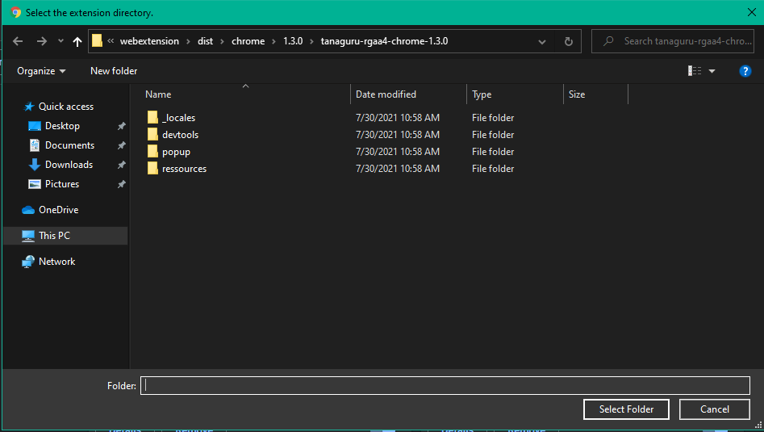
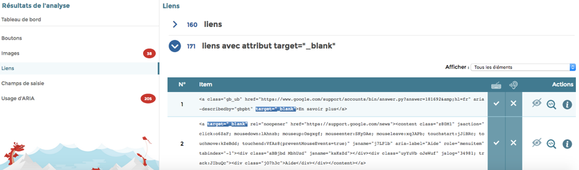

# Tanaguru Webextension


[Clique ici pour lire la version en français](/README.md)

Web accessibility evaluation tool (and more).

## About

* Author : Tanaguru
* Project : Tanaguru Webextension (Firefox and Chrome)
* Date the document was written : 26/02/2018
* Document update date : 30/07/2021

## Summary
- [Install the webextension](#install-the-webextension)
- [Use the webextension](#use-the-webextension)
- [Write a test](#write-a-test)

## Install the webextension

1. **Download or clone the project** ihereci : [project directory](https://github.com/Tanaguru/webextension)
2. To install the webextension, you will need to **download and install Node.js**. [Download page of Node.js](https://nodejs.org/en/download/)
3. **Install the project dependencies and do the "build"** : 
   - access the root folder of the project with a terminal (powershell, git bash...) or open the project with your code editor and lauch the terminal.
   - send this 2 commands in the terminal :
  ```bash
  npm install
  npm run-script build
  ```

4. **Installation on Firefox**

To install the webextension, **in the address bar** of Firefox 57 or highter, type **« about:debugging »**. The « Extensions » page displays :


On this page, activate the link **« This Firefox »**.


On this page, activate the button **« Load Temporary Add-on... »**. A file dialog box will appear. From this box, select on your local disk, the file **« manifest.json »** in the folder "/webextension/dist/firefox/tanaguru-rgaa4-firefox-1.3.0" for RGAA version or "/webextension/dist/firefox/tanaguru-wcag-firefox-1.3.0" for WCAG version. This selection ends the installation of the webextension.


Note : the webextension is temporarily installed. It will be uninstalled when you close Firefox.

5. **Installation on Chrome**

In the address bar of the Chrome browser, type this : **chrome://extensions**

The extensions page is displayed.

On this page activate **Developer mode** and click on the button **"Load unpacked"**.

A file dialog box is displayed.


From this box, select on your local disk, the folder "/webextension/dist/chrome/tanaguru-rgaa4-chrome-1.3.0" for RGAA version or "/webextension/dist/chrome/tanaguru-wcag-chrome-1.3.0" for WCAG version. This selection ends the installation of the webextension.

## Use the webextension

Once the installation is done, a button **"Tanaguru "** appears in the browser toolbar. This button allows the user to know the version of the webextension, the procedure to start the tests and the access to the link allowing to consult the Tanaguru website for more information.


To start the tests, **go to the page to be analyzed**.

Open the development tool. (keyboard shortcut: **ctrl+shift+i**)

Access to the development tool on Firefox : **« Menu > More tools > Web Developer Tools»** 

Access to the development tool on Chrome : **« Menu > More tools > Developer tools»** 

Then in the development tool activate the tab **« Tanaguru »**.


Activate the button **« Analyser cette page »**. Depending on the « complexity » of the DOM of the page to be analyzed, a message may ask you if you want to « Arrêter le script » ou **« Patienter »** (choose "Patientez" to continue). The results are finally displayed instead of the « Analyser cette page » button.


Each result has three buttons :


* **« Highlight on page »** allows you to apply a particular presentation to visually highlight the element on the page.
* **« Reveal in Inspector »** allows you to identify and select the corresponding HTML node in the page's inspector.
* **« About this element »** allows you to consult and retrieve the various information specific to the element (such as XPath and CSS representations).

## Write a test

*Update of the syntax for writing a test (30/07/2021).*

The writing of a RGAA test is done from the Javascript file **« /src/references/rgaa4.js »**.

The writing of a WCAG test is done from the Javascript file **« /src/references/wcag.js »**.

### Function `createTanaguruTest`

The function `createTanaguruTest` allows you to create a new test.

This function takes as parameter a JSON object allowing to define the different characteristics of the test.

```
createTanaguruTest({});
```
#### Test characteristics

| Property | Description | Expected value |
| :-- | :-- | :-- |
| lang | Language of the test | String. |
| name | Test name | String. |
| query | CSS selectors to define the sample | String. |
| contrast | Get a list of text nodes, processed in the contrast.js script | String (name of the array index). |
| code | Get the list of nodes with a duplicate ID | String ("id"). |
| node | Get a node not accessible via the query property. | Node (ex: document.doctype). |
| filter | Filter function to restrict the sample | Function. |
| expectedNbElements | Number of expected elements in the sample (exact or between two limits) allowing to validate or invalidate the test | Integer ou Object (with properties min (Integer), max (Integer) or both). |
| explanations | Explanations associated with the test statuses. | Object (with properties passed (String) and failed (String)). |
| mark | Application of attribute highlights in code passages in the results interface | Object (with property attrs (Array)). |
| tags | Labels associated with the fields. Note: these are not label headings but label identifiers (i18n) | Array de String. |
| ressources | Resources associated with the tests | Object (each property identifying a resource and valued by an Array of String). |

### Test examples

#### Links opening in new windows

For example, if you want to list all links with a `target=“_blank“` attribute :

````
createTanaguruTest({
	lang: 'en',
	name: "Links opening in new windows.",
	query: 'a[href][target="_blank"]:not([role])',
	mark: { attrs: ['target'] },
	tags: ['a11y', 'links'],
	ressources: { 'wcag': ['2.4.4'] }
});
````

Note : the absence of the properties ``expectedNbElements`` and ``explanations`` means that the test will be indicated as to be tested.

#### Links with empty ``title`` attribute

For example, if you want to check that the ``title`` attributes on links are filled in :

````
createTanaguruTest({
	lang: 'en',
	name: 'Links with empty title attribute.',
	query: 'a[href][title]:not([role])',
	filter: function (item) {
		return item.getAttribute('title').trim().length == 0;
	},
	expectedNbElements: 0,
	explanations: {
		'passed': "This page does not contain link elements with empty "title" attribute.",
		'failed': "Links with an empty "title" attribute are present in the page."
	},
	mark: { attrs: ['title'] },
	tags: ['a11y', 'links'],
	ressources: { 'wcag': ['1.1.1', '2.4.4'] }
});
`````

---


